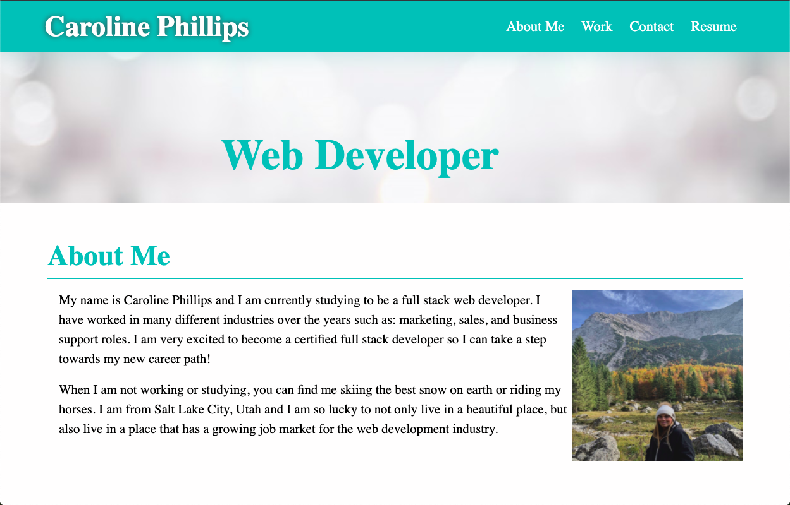

# portfolio

My portfolio was made with HTML and CSS. This portfolio was so possible employers, clients and colleagues have chance to take a look at my work.

I used basic HTML to create the layout of the page and to create the elements. I used a lot of css to make the page look visually appealing and I used 

You can see the live version here https://caroline1418.github.io/portfolio/

